# Medication Management App - Mobile App

Mobile application for taking medications.

## Supported platforms
- Android 36 or higher

## Requirements

- Node.js 22.14 or higher
- Android SDK:
    - emulator 35.4.9 or higher
    - platform-tools 35.0.2 or higher
    - android-36
 
## Demo

[Video demo](./demo/demo_rus.mp4)

### Screenshots
| 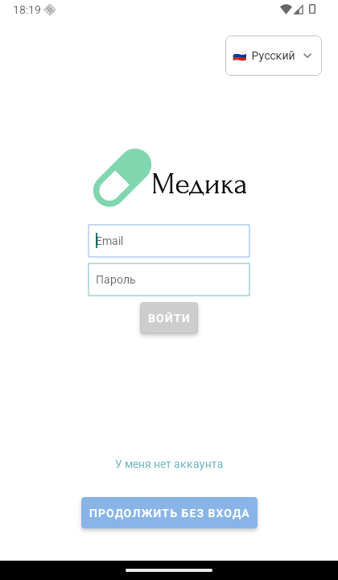 | 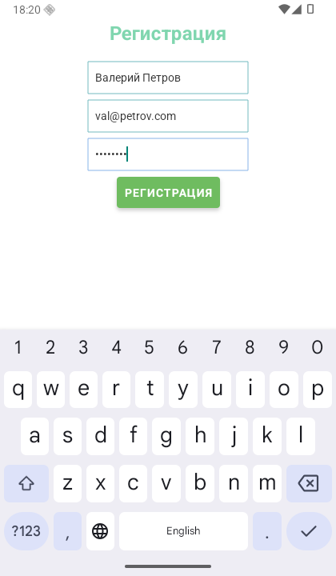 | 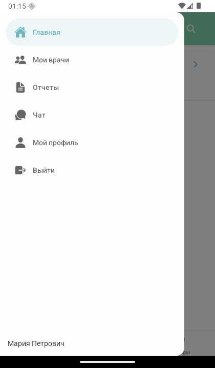 |
|--|--|--|
| 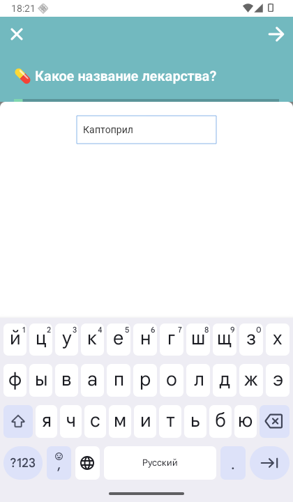 | 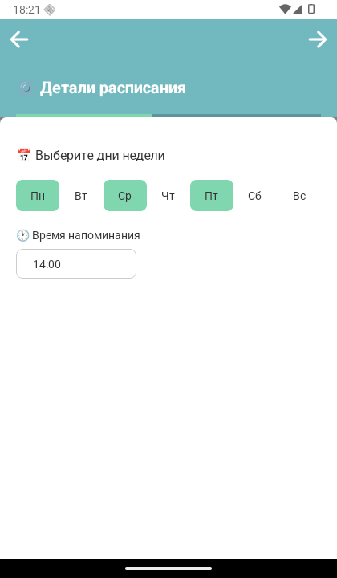 | 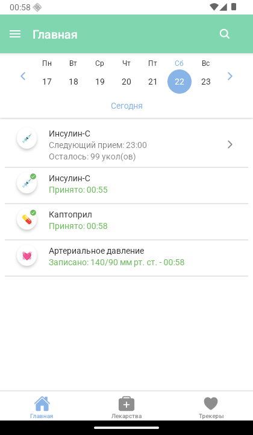 |
| 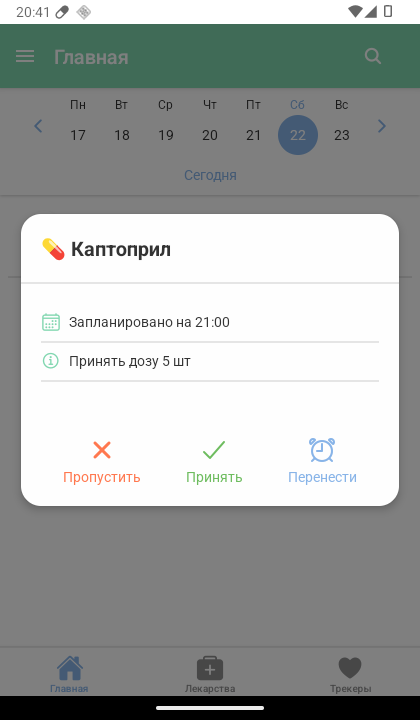 |  | 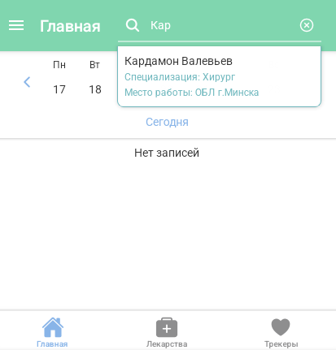 | 
| 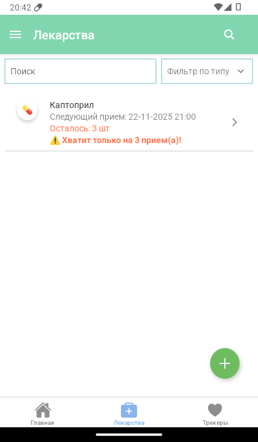 | 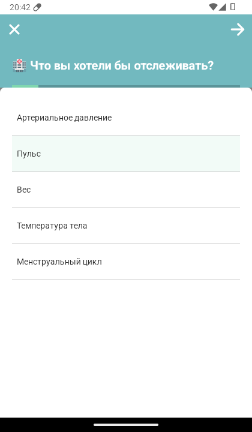 | 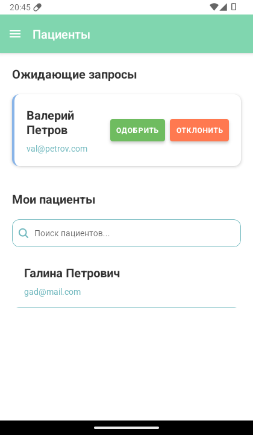 |

## Run the App

1. Prepare `.env` file by using env file example (`.env.example`)
    - The backend server repo: https://github.com/biggytech/medication-management-app-server
2. Install dependencies: `npm install`
3. Start the app: `npm run android` _(this will run the App on Android Emulator or connected Android device)_

### Run with local backend
Run `adb reverse tcp:<PORT> tcp:<PORT>` when running emulator / connected phone, where `PORT` is the port number on your local machine at which the backend runs on.

### Generate APK file
1. Generate key file: `keytool -genkey -v -keystore my-release-key.keystore -alias my-key-alias -keyalg RSA -keysize 2048 -validity 10000`
2. Place the generated `my-release-key.keystore` file under the `android/app`
3. Edit `~/.gradle/gradle.properties` (MacOS / Linux) file and add the following _(replace **** with the correct keystore password, alias and key password)_:
```
MYAPP_RELEASE_STORE_FILE=my-release-key.keystore
MYAPP_RELEASE_KEY_ALIAS=my-key-alias
MYAPP_RELEASE_STORE_PASSWORD=****
MYAPP_RELEASE_KEY_PASSWORD=****
```
If this file doesn't exist, you may create it.
4. Then edit `android/app/build.gradle` and ensure the following are there _(the sections with signingConfigs may need to be added)_:
```
...
android {
    ...
    defaultConfig { ... }
    signingConfigs {
        release {
            if (project.hasProperty('MYAPP_RELEASE_STORE_FILE')) {
                storeFile file(MYAPP_RELEASE_STORE_FILE)
                storePassword MYAPP_RELEASE_STORE_PASSWORD
                keyAlias MYAPP_RELEASE_KEY_ALIAS
                keyPassword MYAPP_RELEASE_KEY_PASSWORD
            }
        }
    }
    buildTypes {
        release {
            ...
            signingConfig signingConfigs.release
        }
    }
}
...
```
5. Build the APK file: `cd android && ./gradlew assembleRelease`
6. Find your signed apk under `android/app/build/outputs/apk/release/app-release.apk`
